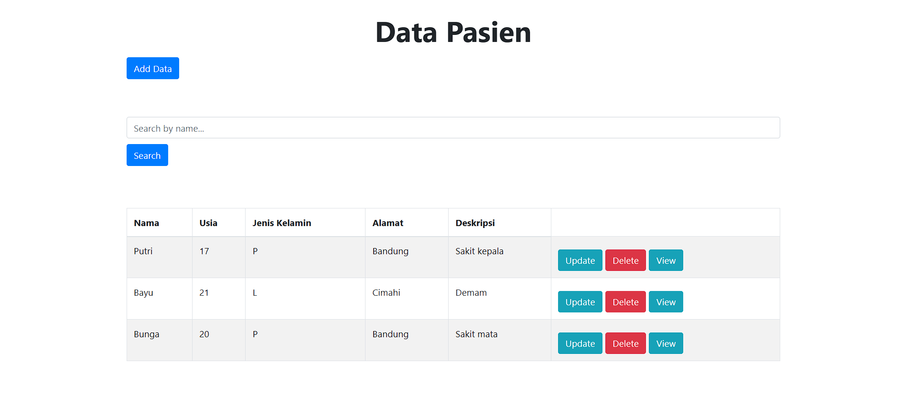
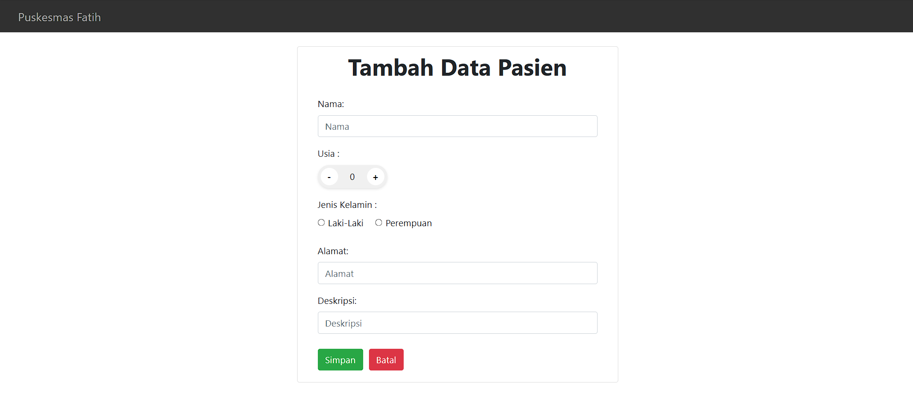
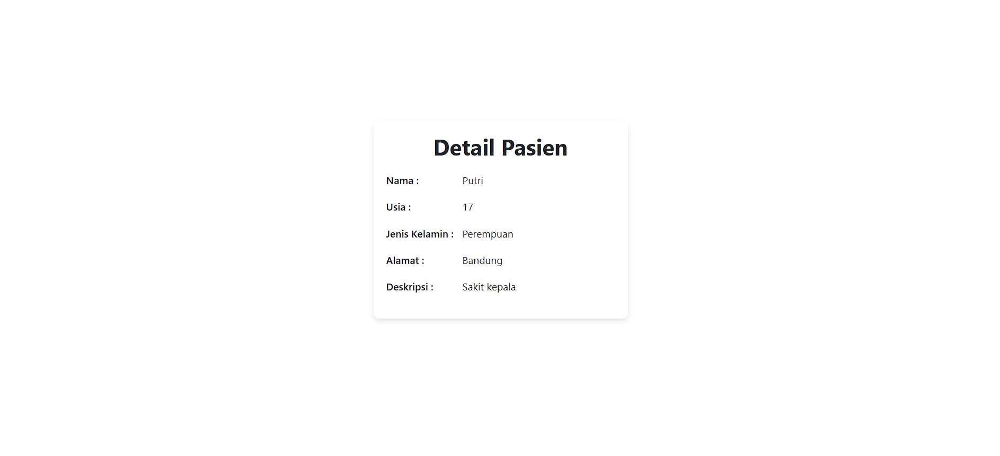

# Clinic Patient Management

A patient management web application built with React, featuring CRUD operations for managing patient records.

The project was originally developed as a full-stack academic web application with a Go REST API and MySQL/MariaDB database. For the public portfolio deployment, the application uses browser `localStorage`, allowing the complete CRUD workflow to be explored without requiring an external backend service.

**Live Demo:** https://clinic-patient-management-beta.vercel.app/

---

## Overview

Clinic Patient Management provides a simple web-based interface for managing patient information.

Users can create, view, update, search, and delete patient records through a React application. Each record contains basic patient information such as:

- Name
- Age
- Gender
- Address
- Medical complaint or description

The public portfolio version stores data locally in the user's browser so the application remains fully interactive without relying on a hosted database or backend server.

---

## Application Preview

### Patient Management

The main interface provides access to patient records and CRUD operations, including adding, updating, deleting, searching, and viewing patient details.



### Add Patient

New patient records can be created through a dedicated form containing basic patient information and medical descriptions.



### Patient Details

Each patient record can be viewed individually through a dedicated detail page.



---

## Features

- View patient records
- Add new patient records
- Edit existing patient information
- Delete patient records
- Search patients by name
- View individual patient details
- Client-side routing using React Router
- Browser-based data persistence using `localStorage`
- Responsive interface using Bootstrap
- Public deployment through Vercel

---

## Technology Stack

| Area | Technology |
| --- | --- |
| Frontend | React |
| Programming Language | JavaScript |
| Routing | React Router |
| UI Framework | Bootstrap |
| Icons | Font Awesome |
| Demo Data Persistence | Browser Local Storage |
| Original Backend | Go |
| Original Database | MySQL / MariaDB |
| Deployment | Vercel |

---

## Application Architecture

### Public Portfolio Demo

The deployed portfolio version uses browser-based storage so users can test the application without requiring an external API or database server.

```text
User
  |
  v
React Application
  |
  v
CRUD Operations
  |
  v
Browser Local Storage
```

### Original Full-Stack Implementation

The original project was developed using a separate Go REST API and relational database.

```text
React Frontend
      |
      v
Go REST API
      |
      v
MySQL / MariaDB
```

The original backend and database implementation are preserved in the repository as part of the project's development history.

---

## Application Flow

```text
User
  |
  v
Patient List
  |
  +---- Add Patient
  |
  +---- Search Patient
  |
  +---- View Patient Details
  |
  +---- Edit Patient
  |
  +---- Delete Patient
  |
  v
Browser Local Storage
```

---

## Project Structure

```text
clinic-patient-management/
│
├── back-end_tubes/
├── public/
├── src/
│
├── docs/
│   ├── patient-list.png
│   ├── add-patient.png
│   └── patient-detail.png
│
├── db_2205330_fatih_uas.sql
├── package.json
├── package-lock.json
└── README.md
```

### Main Components

**`src/`**  
Contains the React frontend application, reusable components, routing, services, and browser-based data management logic.

**`back-end_tubes/`**  
Contains the original Go backend implementation that provides REST API endpoints for patient data.

**`db_2205330_fatih_uas.sql`**  
Contains the original MySQL/MariaDB database structure and sample patient data.

**`docs/`**  
Contains screenshots used for project documentation and portfolio presentation.

---

## Live Demo

The public portfolio version is deployed on Vercel:

https://clinic-patient-management-beta.vercel.app/

The live demo uses browser `localStorage` for data persistence.

This means:

- Data is stored locally in the user's browser
- CRUD operations remain fully functional
- Data is not shared between users or devices
- Clearing browser storage will remove locally stored records
- No external database account is required to explore the application

---

## Data Persistence

The portfolio version uses the browser's `localStorage` API to persist patient records.

Sample records are initialized automatically when the application is opened for the first time.

Changes made through the application, including creating, editing, and deleting patient records, remain stored in the same browser until the local browser storage is cleared.

This implementation is intended specifically for demonstration and portfolio purposes.

---

## Original Backend and Database

The original project includes a Go REST API and MySQL/MariaDB database implementation.

The backend source code is available in:

```text
back-end_tubes/
```

The original SQL database file is available as:

```text
db_2205330_fatih_uas.sql
```

These files are retained to demonstrate the original full-stack architecture and database integration developed for the project.

---

## Running Locally

Clone the repository:

```bash
git clone https://github.com/mialfatih/clinic-patient-management.git
cd clinic-patient-management
```

Install the required dependencies:

```bash
npm install
```

Start the React development server:

```bash
npm start
```

The application will run locally using the React development server.

Because the portfolio version uses browser `localStorage`, no additional database or backend configuration is required to explore the CRUD functionality.

---

## Project Context

This project was originally developed as part of an academic web programming course.

The project provided practical experience with:

- Component-based frontend development using React
- Client-side routing
- CRUD application workflows
- REST API communication
- Backend development using Go
- Relational database integration
- Separating frontend, backend, and database responsibilities
- Deploying a frontend application for public access

For the portfolio version, the frontend was adapted to use browser-based data persistence so the complete application workflow can remain publicly accessible without relying on a paid backend or database service.

---

## Author

**Muhammad Izzuddin Al Fatih**

Computer Science Education  
Universitas Pendidikan Indonesia

GitHub: https://github.com/mialfatih
